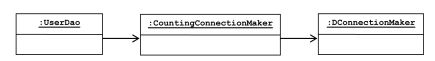
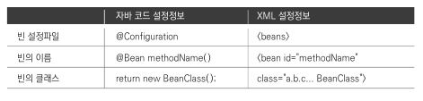

# 1. 오브젝트와 의존관계

## 1.1 DAO

### DAO
DAO(Data Access Object)는 DB를 사용해 데이터 조회, 조작 등의 기능을 담당하는 오브젝트.

<br>

### 자바빈
다음 두 가지 관례를 따라 만들어빈 오브젝트. 간단히 빈이라고 부르기도 함.
* 디폴트 생성자 : 자바빈은 파라미터가 없는 디폴트 생성자를 갖고있어야 함. 툴이나 프레임워크에서 리플렉션을 이용해 오브젝트를 생성하기 때문에 필요하다.
* 프로퍼티 : 자바빈이 노출하는 이름을 가진 속성을 프로퍼티라고 한다. 프로퍼티는 setter, getter를 이용해 수정 또는 조회할 수 있다.

<br>

## 1.2 DAO의 분리

### 디자인 패턴
자주 만나는 문제를 해결하기 위해 사용할 수 있는 재사용 가능한 솔루션.<br>
GoF의 디자인 패턴(에릭 감마 외), Head First Design Patterns(에릭 프리먼) 참고.

<br>

### 템플릿 메소드 패턴
상속을 통해 슈퍼클래스의 기능을 확장할 때 사용하는 가장 대표적인 방법. 변하지 않는 기능은 슈퍼클래스에 만들어두고 자주 변경되며 확장할 기능은 서브클래스에서 만들도록 한다. 슈퍼클래스에서는 미리 추상 메소드 혹은 오버라이드 가능한 메소드를 정의해두고 이를 활용해 코드의 기본 알고리즘을 담고있는 템플릿 메소드를 만든다.
```java
public abstract class Super{
    public void templateMethod(){
        hookMethod();
        abstractMethod();
        ...
    }
    protected void hookMethod(){ }
    public abstract void abstractMethod();
}
```
```java
public class Sub1 extends Super{
    protected void hookMethod() {
        ...
    }
    public void abstractMethod() {
        ...
    }
}
```
<br>

### 팩토리 메소드 패턴
팩토리 메소드 패턴도 템플릿 메소드 패턴과 마찬가지로 상속을 통해 기능을 확장하게 하는 패턴. 구조도 비슷하다. 하지만 이 메소드는 주로 인터페이스 타입으로 오브젝트를 리턴하므로 서브클래스에서 정확히 어떤 클래스의 오브젝트를 만들어 리턴할지는 슈퍼클래스에서는 알지 못한다. (아래 코드는 인터페이스는 아니고 추상 클래스로 팩토리 메소드 패턴을 사용)
```java
public abstract class UserDao {
    public void add(User user) throws Exception{
        Connection c = getConnection();
        ...
    }

    public User get(String id) throws Exception{
        ...
    }

    public abstract Connection getConnection() throws Exception;
}
```
```java
public class NUserDao extends UserDao{
    public Connection getConnection() throws Exception{
        //N사 DB Connection 생성코드
    }
}
```
```java
public class KUserDao extends UserDao{
    public Connection getConnection() throws Exception{
        //K사 DB Connection 생성코드
    }
}
```

<br>

## 1.3 DAO 확장

### 클래스의 분리
ex) DB커넥션과 관련된 부분을 서브클래스가 아니라, 아예 별도의 클래스에 담는 것.
```java
public class UserDao{
    private SimpleConnectionMaker simpleConnectionMaker;

    public UserDao(){
        simpleConnectionMaker = new SimpleConnectionMaker();
    }

    public void add(User user) throws Exception{
        Connection c = simpleConnectionMaker.makeNewConnection();
        ...
    }

    public User get(String id) throws Exception{
        Connection c = simpleConnectionMaker.makeNewConnection();
        ...
    }
}
```
위 코드의 문제
* makeConnection()을 타사에서 만든 createConnection() 이라는 메소드 이름으로 변경하려면 add, get 코드 모두 변경해야함.
* DB커넥션을 제공하는 클래스가 어떤 것인지 UserDao가 구체적으로 알고 있어야 합니다. UserDao에 SimpleConnectionMaker라는 클래스 타입의 인스턴스 변수까지 정의해놓고 있어 타사에서 다른 클래스를 구현하면 UserDao 자체를 다시 수정해야함.

<br>

### 인터페이스의 도입
인터페이스는 어떤 일을 하겠다는 기능만 정의해놓은 것. 따라서 인터페이스에는 어떻게 하겠다는 구현방법은 필요가 없으므로 위의 문제를 해결할 수 있다.

```java
package springproject1.user.dao;
...

public interface ConnectionMaker{
    public Connection makeConnection() throws Exception;
}
```
```java
package springproject1.user.dao;
...

public class NConnectionMaker implements ConnectionMaker {
    ...
    public Connection makeConnection() throws Exception{
        //N사의 독자적 Connection 생성 코드
    }
}
```
```java
public class UserDao{
    private ConnectionMaker connectionMaker;

    public UserDao(){
        connectionMaker = new NConnectionMaker();
    }

    public void add(User user) throws Exception{
        Connection c = connectionMaker.makeNewConnection();
        ...
    }

    public User get(String id) throws Exception{
        Connection c = connectionMaker.makeNewConnection();
        ...
    }
}
```
위 코드의 문제
* NConnectionMaker의 생성자를 호출해서 오브젝트를 생성함. 필요할 때 마다 UserDao 생성자 메소드를 직접 수정해야한다.

<br>

### 관계설정 책임의 분리
UserDao가 어떤 ConnectionMaker를 사용할지를 결정하는 코드가 남아있다. 따라서 ConnectionMaker를 생성하는 책임을 UserDao가 아닌 클라이언트에게 넘기도록 한다.
```java
public UserDao(ConnectionMaker connectionMaker){
    this.connectionMaker = connectionMaker
}
```

```java
public class UserDaoTest {
    public static void main(String[] args) throws Exception {
        ConnectionMaker connectionMaker = new KConnectionMaker();

        UserDao dao = new UserDao(connectionMaker);
    }
}
```

<br>

### 원칙과 패턴
#### 개방 폐쇄 원칙
개방 폐쇄 원칙(OCP, Open-Closed Principle)을 이용하면 지금까지 해온 리팩토링 작업의 특징과 최종적으로 개선된 설계와 코드의 장점이 무엇인지 설명 가능하다. 간단히 설명하자면 '클래스나 모듈은 확장에는 열려있어야 하고 변경에는 닫혀있어야 한다'.

<br>

#### 높은 응집도와 낮은 결합도
* 높은 응집도 : 응집도가 높다는 것은 변화가 일어날 때 해당 모듈에서 변하는 부분이 크다는 것. 즉 변경이 일어날 때 모듈의 많은 부분이 함께 봐뀐다면 응집도가 높다고 말할 수 있다. 위 코드에서 connectionMaker 부분을 NConnectionMaker로 변경하면 DB 연결방식 전체가 변경되는 것.
* 낮은 결합도 : 결합도란 '하나의 오브젝트가 변경이 일어날 때 관계를 맺고 있는 다른 오브젝트에게 변화를 요구하는 정도'. 위 코드에서 DB 연결방식을 바꾸려면 ConnectionMaker만 변경하면 되게 함으로써 낮은 결합도를 유도한 것.

<br>

#### 전략 패턴

<br>

## 1.4 제어의 역전 (IoC)
### 오브젝트 팩토리
지금까지 과정에서 UserDaoTest가 엉겁결에 어떤 ConnectionMaker 구현 클래스를 사용할 지 기능을 떠맡았다. 하지만 UserDaoTest는 UserDao의 기능이 잘 동작하는지 테스트하려고 만든 것이다. 따라서 해당 사항도 분리가 필요하다.

#### 팩토리
이 클래스의 역할은 객체의 생성 방법을 결정하고 그렇게 만들어진 오브젝트를 돌려주는 것이다. 이는 디자인 패턴에서 말하는 추상 팩토리 패턴이나 팩토리 메소드 패턴과는 다르다.
```java
public class DaoFactory {
	public UserDao userDao(){
		ConnectionMaker connectionMaker = new NConnectionMaker();
		UserDao userDao = new UserDao(connectionMaker);
		return userDao;
	}
}
```

```java
public class UserDaoTest {
	public static void main(String[] args) throws Exception{
		UserDao dao = new DaoFactory().userDao();
	}
}
```

<br>

#### 설계도로서의 팩토리

<br>

### 오브젝트 팩토리의 활용
아래 코드는 팩토리 메소드 안에 모두 new DConnectionMaker라는 ConnectionMaker 구현 클래스의 인스턴스를 만드는 부분이 반복되서 나타난다. 이렇게 오브젝트 생성 코드가 중복되는 건 좋지 않은 현상이다. DAO가 더 많아지면 ConnectionMaker의 구현 클래스가 변경될 때 마다 모든 메소드를 일일이 수정해야하기 때문이다.
```java
public class DaoFactory{
	public UserDao userDao(){
		return new UserDao(new DConnectionMaker());
	}
	
	public MessageDao userDao(){
		return new MessageDao(new DConnectionMaker());
	}
}
```
중복 문제를 해결하기 위해 ConnectionMaker의 구현 클래스를 결정하고 오브젝트를 만드는 코드를 분리시키겠다.
```java
public class DaoFactory{
	public UserDao userDao(){
		return new UserDao(connectionMaker());
	}
	
	public MessageDao userDao(){
		return new MessageDao(connectionMaker());
	}
	
	public ConnectionMaker connectionMaker(){
		return new DConnectionMaker();
	}
}
```

<br>

### 제어권의 이전을 통한 제어관계 역전
제어의 역전에서는 오브젝트가 자신이 사용할 오브젝트를 스스로 선택하지 않고 생성하지도 않는다. 자신도 어떻게 만들어지고 어디서 사용되는지 알 수 없다. 모든 제어 권한을 자신이 아닌 다른 대상에게 위임하기 때문이다. <br>
제어의 역전 개념은 이미 폭넓게 사용되고 있다. 예를 들어 서블릿이 있따. 서블릿을 개발해서 서버에 배포할 수는 있지만 그 실행을 개발자가 직접 제어할 수는 없다. 서블릿에 대한 제어 권한을 가진 컨테이너가 적절한 시점에 서블릿 클래스의 오브젝트를 만들고 그 안의 메소드를 호출한다.
<br>
프레임워크도 제어의 역전 개념이 적용된 대표적인 기술이다. 프레임워크는 라이브러리의 다른 이름이 아니다. 라이브러리를 사용하는 애플리케이션 코드는 애플리케이션 흐름을 직접 제어한다. 동작하는 중에 필요한 기능이 있을 때 라이브러리를 사용할 뿐이다. 하지만 프레임워크는 애플리케이션 코드가 프레임워크에 의해 사용된다. 애플리케이션 코드는 프레임워크가 짜놓은 틀에서 수동적으로 동작해야 한다.
<br>
스프링은 IoC를 모든 기능의 기초가 되는 기반기술로 삼고있으며 IoC를 극한까지 적용하고 있는 프레임워크이다.

<br>

## 1.5 스프링의 IoC
스프링의 핵심을 담당하는 건 빈 팩토리 혹은 애플리케이션 컨텍스트이다. 위 과정에서 만든 DaoFactory가 하는 일을 좀 더 일반화한 것이라고도 설명할 수 있다.

### 오브젝트 팩토리를 이용한 스프링 IoC
#### 애플리케이션 컨텍스트와 설정정보
스프링에서는 스프링이 제어권을 가지고 직접 만들고 관계를 부여하는 오브젝트를 빈(bean)이라 한다. 자바빈 또는 EJB에서 말하는 빈과 비슷한 오브젝트 단위의 애플리케이션 컴포넌트를 말한다. 동시에 스프링 빈은 스프링 컨테이너가 생성과 관계설정, 사용 등을 제어해주는 제어의 역전이 적용된 오브젝트를 가리키는 말이다. <br>
스프링에서는 빈의 생성과 관계설정 같은 제어를 담당하는 IoC오브젝트를 빈 팩토리(Bean Factory)라 한다. 이를 좀 더 확장한 애플리케이션 컨텍스트(Application Context)를 주로 사용한다.

<br>

#### DaoFactory를 사용하는 애플리케이션 컨텍스트
```java
import org.springframework.context.annotation.Bean;
import org.springframework.context.annotation.Configuration;
...
@Configuration // 애플리케이션 컨텍스트가 사용할 설정정보라는 표시
public class DaoFactory{
	@Bean // 오브젝트 생성을 담당하는 IoC용 메소드라는 표시
	public UserDao userDao(){
		return new UserDao(connectionMaker());
	}
	
	@Bean
	public ConnectionMaker connectionMaker(){
		return new DConnectionMaker();
	}
}
```

```java
public class UserDaoTest{
	public static void main(String[] args) throws Exception{
		Application context = new AnnotationConfigApplicationContext(DaoFactory.class);
		UserDao dao = context.getBean("userDao", UserDao.class);
	}
}
```
위 코드에서 UserDao를 가져오는 메소드는 하나뿐인데 왜 굳이 이름을 사용할까 생각해보자. 그것은 UserDao를 생성하는 방식이나 구성을 다르게 가져가는 메소드를 추가할 수 있기 때문이다. 그 때는 specialUserDao()라는 메소드로 만들고 getBean("specialUserDao", UserDao.class)로 가져오면 된다. <br>
getBean()은 기본적으로 Object 타입으로 리턴하게 되어있어 매번 리턴되는 오브젝트에 다시 캐스팅을 해줘야 하는 부담이 있따. 자바 5 이상의 Generic 메소드 방식을 사용해 getBean()의 두 번째 파라미터에 리턴 타입을 주면, 지저분한 캐스팅코드를 사용하지 않아도 된다.
<br>
■ 추가할 라이브러리
* com.springsource.net.sf.cglib
* com.springsource.org.apache.commons.logging
* org.springframework.asm
* org.springframework.beans
* org.springframework.context
* org.springframework.core
* org.springframework.expression

<br>

### 애플리케이션 컨텍스트의 동작방식
#### 추가 예정

<br>

### 스프링 IoC의 용어 정리
* 빈(bean) : 스프링이 IoC 방식으로 관리하는 오브젝트(managed object). 스프링 애플리케이션에서 만들어진 모든 오브젝트가 다 빈은 아니다. 스프링이 직접 그 생성과 제어를 담당하는 오브젝트만 포함한다.
* 빈 팩토리(bean factory) : 스프링의 IoC를 담당하는 핵심 컨테이너. 빈을 등록하고 생성하고 조회하는 등 빈을 관리하는 기능을 담당한다. 보통은 이 빈 팩토리를 바로 사용하지 않고 애플리케이션 컨텍스트를 이용한다. BeanFactory라고 붙여쓰면 빈 팩토리가 구현하고 있는 가장 기본적인 인터페이스의 이름이 된다.
* 애플리케이션 컨텍스트(application context) : 빈 팩토리를 확장한 IoC 컨테이너. 빈 팩토리의 기능에 스프링이 제공하는 각종 부가 서비스를 추가로 제공한다. ApplicationContext 인터페이스는 BeanFactory를 상속한다.
* 설정정보/설정 메타정보(configuration metadata) : 애플리케이션 컨텍스트 또는 빈 팩토리가 IoC를 적용하기 위해 사용하는 메타정보. 영어로 'configuration'이라고 하는데, 이는 구성정보를 뜻한다.
* 컨테이너(container) 혹은 IoC 컨테이너 : 애플리케이션 컨텍스트나 빈 팩토리를 컨테이너라고 한다.

<br>

### 싱글톤 레지스트리와 오브젝트 스코프
```java
DaoFactory factory = new DaoFactory();
UserDao dao1 = factory.userDao();
UserDao dao2 = factory.userDao();

System.out.println(dao1);
System.out.println(dao2);
```
위 코드의 결과는 아래와 같다.
```
springproject1.dao.UserDao@118f375
springproject1.dao.UserDao@117a8bd
```
출력 결과에서 알 수 있듯이 두 개는 각기 다른 값을 가진 동일하지 않은 오브젝트이다.
<br>
```java
ApplicationContext context = new ApplicationConfigApplicationContext(DaoFactory.class);
UserDao dao3 = context.getBean("userDao", UserDao.class);
UserDao dao4 = context.getBean("userDao", UserDao.class);

System.out.println(dao3);
System.out.println(dao4);
```
위 코드의 결과는 아래와 같다.
```
springproject1.dao.UserDao@ee22f7
springproject1.dao.UserDao@ee22f7
```
둘은 동일한 오브젝트이다. dao3 == dao4를 출력하면 true라고 나온다.

<br>

### 싱글톤 레지스트리로서의 애플리케이션 컨텍스트
애플리케이션 컨텍스트는 싱글톤을 저장하고 관리하는 싱글톤 레지스트리이기도 하다. <br>
스프링은 기본적으로 별다른 설정을 하지 않으면 내부에서 생성하는 빈 오브젝트를 모두 싱글톤으로 만든다. 싱글톤 패턴과 비슷한 개념이지만 구현 방법은 확연히 다르다.

<br>

#### 서버 애플리케이션과 싱글톤
매번 클라이언트에서 요청이 올 때마다 각 로직을 담당하는 오브젝트를 새로 만들어서 사용한다면, 요청 한 번에 5개의 오브젝트가 만들어지고 초당 500개의 요청이 들어올 떄 초당 2500개의 새로운 오브젝트가 생성된다. 이렇게 부하가 걸리면 서버가 감당할 수 없다. <br>
따라서 엔터프라이즈 분야에서는 서비스 오브젝트라는 개념을 사용해왔다. 스펙에서 강제하진 않지만 서블릿은 대부분 멀티스레드 환경에서 싱글톤으로 동작한다. <br>
위에서도 알 수 있듯 서버 환경에서는 서비스 싱글톤의 사용이 권장된다. 하지만 사용하기 까다롭고 여러가지 문제점이 있어 이를 피해야할 패턴이라는 뜻에서 안티패턴이라 부르기도 한다. <br>

#### 싱글톤 패턴의 한계
일반적으로 아래와 같이 싱글톤을 구현한다.
* 클래스 밖에서는 오브젝트를 생성하지 못하도록 생성자를 private으로 만든다.
* 생성된 싱글톤 오브젝트를 저장할 수 있는 자신과 같은 타입의 스태틱 필드를 정의한다.
* 스태틱 팩토리 메소드인 getInstance()를 만들고 이 메소드가 최초로 호출되는 시점에서만 오브젝트가 생성된다. 생성된 오브젝트는 스태틱 필드에 저장하거나 초기값으로 오브젝트를 미리 만든다.
* 한번 오브젝트(싱글톤)가 만들어지고 난 이후에는 getInstance() 메소드를 통해 이미 만들어져 스태틱 필드에 저장된 오브젝트를 넘겨준다.

```java
public class UserDao{
	private static UserDao INSTANCE;
	...
	private UserDao(ConnectionMaker connectionMaker){
		this.connectionMaker = connectionMaker;
	}
	
	public static syncronized UserDao getInstance(){
		if(INSTANCE==null) INSTANCE = new UserDao(~~~);
		return INSTANCE;
	}
}
```
위 처럼 구현하게 되면 생성자가 private이기 때문에 DaoFactory를 사용하는 것이 불가능해졌다. 따라서 UserDao에 싱글톤을 적용하는 것은 조금 무리가 있다.
<br>
싱긅톤 패턴의 단점을 정리하면 다음과 같은 문제가 있다. <br>
* **private 생성자를 갖고 있기 때문에 상속할 수 없다.** 싱글톤 패턴은 생성자를 private으로 제한하기 때문에 자기 자신만이 오브젝트를 생성하도록 한다. 또한 private 생성자를 가진 클래스는 다른 생성자가 없다면 상속이 불가능한데 이 또한 문제점이 된다. 객체지향의 장점인 상속과 다형성을 적용할 수 없기 때문이다. 스태틱 필드와 메소드를 사용하는 것도 동일한 문제점이 있다.
* **싱글톤은 테스트하기가 힘들다.** 만들어지는 방식이 제한적이기 때문에 목 오브젝트 등으로 대체하기가 힘들다. 
* **서버환경에서는 싱글톤이 하나만 만들어지는 것을 보장하지 못한다.** 서버에서 클래스 로더를 어떻게 구성하고 있느냐에 따라 싱글톤 클래스임에도 하나 이상의 오브젝트가 만들어질 수 있다. 여러 개의 JVM에 분산돼서 설치가 되는 경우에도 각각 독립적으로 오브젝트가 생기기 때문에 싱글톤으로서 가치가 떨어진다.
* **싱글톤의 사용은 전역 상태를 만들 수 있다.** 싱글톤은 사용하는 클라이언트가 정해져있지 않고 스태틱 메소드를 통해 언제든 접근 가능하기 때문에 어디서든지 사용될 수 있기 때문이다.

<br>

#### 싱글톤 레지스트리
스프링은 서버환경에서 싱글톤이 만들어져 서비스 오브젝트 방식으로 사용되는 것은 적극 지지한다. 하지만 싱글톤 패턴은 위와 같은 단점이 있기 때문에, 스프링이 직접 싱글톤 형태의 오브젝트를 만들고 관리하는 기능을 제공한다. 이를 **싱글톤 레지스트리**라 한다. 싱글톤 레지스트리의 장점은 스태틱 메소드나 private 생성자를 사용하지 않고 평범한 자바 클래스를 싱글톤으로 활용하게 해준다는 점이다. 스프링이 빈을 싱글톤으로 만드는 것은 오브젝트의 생성 방법을 제어하는 IoC컨테이너로서의 역할이다. **'싱글톤 레지스트리와 오브젝트 스코프'**에서 확인했듯이 지금까지의 코드는 이미 UserDao를 싱글톤으로 만들고 있다.

<br>

### 싱글톤과 오브젝트의 상태
싱글톤은 멀티스레드 환경이라면 여러 스레드가 동시에 접근해서 사용할 수 있다. 따라서 상태 관리에 주의를 기울여야 한다. 기본적으로 무상태(stateless) 방식으로 만들어져야 한다. 저장할 공간이 하나뿐이니 서로 값을 덮어쓰고 자신이 저장하지 않은 값을 읽어올 수 있기 때문이다. 따라서 싱글톤은 인스턴스 필드의 값을 변경하고 유지하는 상태유지(stateful)방식으로 만들지 않는다. 무상태 방식으로 클래스를 만드는 경우는 메소드를 통한 파라미터, 로컬 변수, 리턴 값 등을 이용해서 구현한다.

```java
public class UserDao{
	private ConnectionMaker connectionMaker;
	private Coneection c;
	private User user;
	
	public User get(String id) throws Exception{
		this.c = connectionMaker.makeConnection();
		...
		this.user = new User();
		this.user.setName(rs.getString("name"));
		
		return this.user;
}
```
위처럼 user를 클래스의 인스턴스 필드로 선언할 경우 위에서 말한 문제가 발생할 수 있다. 하지만 connectionMaker의 경우 읽기전용의 정보이기 때문에 위의 문제와 무관하다. <br> 하지만 단순한 읽기전용 값이라면 static final이나 final로 선언하는 편이 나을 것이다.

<br>

### 스프링 빈의 스코프
스프링이 관리하는 오브젝트, 즉 빈이 생성되고 존재하고 적용되는 범위를 빈의 스코프라 한다. 스프링 빈의 기본 스코프는 싱글톤으로 컨테이너 내에 한 개의 오브젝트만 만들어져 강제로 제거하지 않는 한 컨테이너가 존재하는 동안 계속 유지된다. <br> (그 외에는 prototype, request, session 등이 있고 이는 10장에서 다를 것이다.)

<br>

## 1.7 의존관계 주입(DI)
### 제어의 역전(IoC)과 의존관계 주입
스프링은 IoC 컨테이너라는 것 만으로는 설명이 부족하다. IoC는 위의 설명에서도 자주 언급되었듯이 느슨하고 폭넓게 이용되기 때문이다. 그래서 의존관계 주입(DI, Dependency Injection)이라는 용어가 나왔다.
### 런타임 의존관계 설정
#### 의존관계
지금까지 작업해왔던 UserDao의 경우 ConnectionMaker에 의존하고있는 형태이다. ConnectionMaker 인터페이스가 변한다면 UserDao가 영향을 받게 된다. 하지만 ConnectionMaker 인터페이스를 구현한 클래스인 KConnectionMaker등이 바뀌더라도 UserDao에 영향을 주지 않는다. 이렇게 인터페이스에 대해서만 의존관계를 만들면 인터페이스 구현 클래스의 영향을 덜 받는 상태가 되며 결합도가 낮다고 설명할 수 있다.<br>
위 처럼 설계 모델이나 코드에서 드러나는 의존관계 외에 런타임 의존관계가 있다. 프로그램이 시작되고 UserDao 오브젝트가 만들어지고 런타임 시에 의존관계를 맺는 대상을 의존 오브젝트라고 말한다.<br><br>
의존관계 주입이란 다음 세 가지 조건을 충족하는 작업이다.
* 클래스 모델이나 코드에는 런타임 시점의 의존관계가 드러나지 않는다. 그러기 위해서는 인터페이스에만 의존하고 있어야 한다.
* 런타임 시점의 의존관계는 컨테이너나 팩토리 같은 제 3의 존재가 결정한다.
* 의존관계는 오브젝트에 대한 레퍼런스를 외부에서 제공(주입)해줌으로써 만들어진다.

#### UserDao의 의존관계 주입
```java
public UserDao(){
	connectionMaker = new DConnectionMaker();
}
```
우리가 작업한 UserDao는 위 코드처럼 DConnectionMaker를 사용하겠다를 UserDao에서 결정하고 관리하고있다. 런타임 의존관계가 코드속에 미리 결정되어있다는 것이다. 따라서 IoC 방식으로 제3의존재에 런타임 의존관계 결정 권한을 위임하도록 수정하겠다.
```java
public class UserDao(){
	private ConnectionMaker connectionMaker;
	
	public UserDao(ConnectionMaker connectionMaker){
		this.connectionMaker = connectionMaker;
	}
}
```
위 처럼 DI는 자신이 사용할 오브젝트에 대한 제어를 외부로 넘김으로써 IoC개념에도 잘 들어맞는다.

<br>

### 의존관계 검색과 주입
스프링이 제공하는 IoC에는 의존관계 주입만 있는 것이 아니다. 의존관계를 외부로부터의 주입이 아니라 스스로 검색을 이용하기 때문에 의존관계 검색(dependency lookup)이라고 불리는 것도 있다. 의존관계 검색은 자신이 필요한 의존 오브젝트를 능동적으로 찾는다. 물론 자신이 어떤 클래스의 오브젝트를 이용할지 결정하지는 않는다.
```java
public UserDao(){
	DaoFactory daoFactory = new DaoFactory();
	this.connectionMaker = daoFactory.connectionMaker();
}
```
이렇게 해도 자신이 어떤 ConnectionMaker 오브젝트를 사용할지 알지 못한다. 하지만 아래처럼 getBean()을 활용하여 의존관계 검색으로 사용할 수도 있다.
```java
public UserDao(){
	AnnotationConfigApplicationContext context = new AnnotationConfigApplicationContext(DaoFactory.class);
	this.connectionMaker = context.getBean("connectionMaker",ConnectionMaker.class);
}
```
의존관계 주입이 코드가 깔끔하기 때문에 주로 의존관계 주입 방식을 사용하지만 의존관계 검색 방식을 사용해야할 때가 있다.
```java
public class UserDaoTest{
	public static void main(String[] args) throws Exception{
		Application context = new AnnotationConfigApplicationContext(DaoFactory.class);
		UserDao dao = context.getBean("userDao", UserDao.class);
	}
}
```
위의 예를 들자면 스태틱 메소드인 main()에서는 DI를 이용해 오브젝트를 주입받을 방법이 없는 경우이다. 서버에서도 main()메소드와 비슷한 역할을 하는 서블릿에서 스프링 컨테이너에 담긴 오브젝트를 사용하려면 한 번은 의존관계 검색 방식을 사용해야한다. 다행히 이런 서블릿은 스프링이 미리 만들어서 제공하기 때문에 직접 구현할 필요는 없다.

### 의존관계 주입의 응용
#### 기능 구현의 교환
로컬 DB로 사용하던 것을 개발이 완료되면 운영서버로 배치해서 사용할 것이다. 그런데 만약 DI 방식을 적용하지 않았다면 로컬 DB연결 기능이 있는 LocalDBConnectionMaker를 수정해야할 때 DAO가 100개라면 최소한 100군데 이상 코드를 수정해야 한다. <dr>
반면에 DI 방식을 적용하였다면 @Configuration이 붙은 Factory를 수정하면 된다.
```java
@Bean
public ConnectionMaker connectionMaker(){
	return new LocalDBConnectionMaker();
}
```
위와 같은 개발용 코드를 아래처럼 변경하면 된다.
```java
@Bean
public ConnectionMaker connectionMaker(){
	return new ProductionDBConnectionMaker();
}
```

<br>

#### 부가기능 추가
모든 DAO의 makeConnection() 메소드를 호출하는 부분에 새로 count를 세는 코드를 추가한다고 해보자. DI를 이용한다면 기존 코드의 수정 없이 컨테이너가 사용하는 설정정보만 수정해서 런타임 의존관계만 새롭게 정의해주면 된다.
```java
public class CountingConnectionMaker implements ConnectionMaker{
	int count = 0;
	private ConnectionMaker realConnectionMaker;
	
	public CountingConnectionMaker(ConnectionMaker realConnectionMaker){
		this.realConnectionMaker = realConnectionMaker;
	}
	
	public Connection makeConnection() throws Exception{
		this.count++;
		return realConnectionMaker.makeConnection();
	}
	
	public int getCounter(){
		return this.counter;
	}
}
```
CountingConnectionMaker 클래스는 ConnectionMaker 인터페이스를 구현했지만 내부에서 직접 DB커넥션을 만들지 않는다. 대신 DAO가 DB커넥션을 가져올 때마다 호출하는 makeConnectio()에서 DB 연결횟수 카운터를 증가시킨다. <br>
의존관계는 다음 그림과 같다. <br>


이 그림을 아래 코드로 변경하면 다음과 같다.

```java
@Configuration
public class CountingDaoFactory{
	@Bean
	public UserDao userDao(){
		return new UserDao(connectionMaker());
	}
	
	@Bean
	public ConnectionMaker connectionMaker(){
		return new CountingConnectionMaker(realConnectionMaker());
	}
	
	@Bean
	public ConnectionMaker realConnectionMaker();{
		return new KConnectionMaker();
	}
}
```
그 다음 실행코드를 만들자면 다음과 같다.

```java
public class UserDaoConnectionCountingTest{
	public static void main(String[] args) throws Exception{
		AnnotationConfigApplicationContext context = new AnnotationConfigApplicationContext(CountingDaoFactory.class);
		UserDao dao = context.getBean("userDao", UserDao.class);
	
	
		//
		//DAO 사용코드
		//
		
		CountingConnectionMaker ccm = context.getBean("connectionMaker", CountingConnectionMaker.class);
		System.out.println("Connection Count : " + ccm.getCount());
	}
}
```
지금은 DAO가 하나뿐이지만 DAO가 수백 개여도 상관이 없다. DI의 장점은 관심사의 분리(SoC)를 통해 얻어지는 높은 응집도에서 나온다. 

<br>

### 메소드를 이용한 의존관계 주입
지금까지는 UserDao 의존관계 주입을 위해 생성자를 사용했다. 생서자에 파라미터를 만들어두고 이를 통해 DI 컨테이너가 의존할 오브젝트 레퍼런스를 넘겨주도록 만들었다. 하지만 생성자가 아닌 일반 메소드를 사용할 수도 있다.
* **수정자 메소드를 이용한 주입** : 수정자(setter)메소드는 외부로부터 제공받은 오브젝트 레퍼런스를 저장해뒀다가 내부의 메소드에서 사용하게 하는 DI 방식에서 활용하기에 적절하다.
```java
public class UserDao{
	private ConnectionMaker connectionMaker;
	
	public void setConnectionMaker(ConnectionMaker connectionMaker){
		this.connectionMaker = connectionMaker;
	}
}
```
```java
@Bean
public UserDao userDao(){
	UserDao userDao = new UserDao();
	userDao.setConnectionMaker(connectionMaker());
	return userDao;
}
```
* **일반 메소드를 이용한 주입** : 수정자 메소드처럼 set으로 시작해야하고 한 번에 한 개의 파라미터만 가질 수 있다는 제약이 싫다면 일반 메소드를 통해 활용해도 된다.

<br>

## 1.8 XML을 이용한 설정
DaoFactory는 대부분 틀에 박힌 구조가 반복된다. 또한 DI 구성이 바뀔 때마다 자바 코드를 수정하고 클래스를 다시 컴파일하는 것은 귀찮은 작업이다.
<br>
스프링은 DaoFactory와 같은 자바 클래스 외에도 XML을 이용하여 DI 의존관계 설정정보를 만들 수 있다.
<br>
### XML 설정
위 코드들에서 @Configuration을 <beans>, @Bean을 <bean>에 대응하면 된다.<br>

<br>
#### ConnectionMaker 전환
```java
@Bean // <bean
public ConnectionMaker
connectionMaker(){ // id="connectionMaker"
	return new KConnectionMaker(); // class="spring...KConnectionMaker"/>
}
```
```xml
<bean id = "connectionMaker" class = "spring...KConnectionMaker"/>
```
<br>

#### UserDao의 전환
XML에서는 <property> 태그를 사용해 의존 오브젝트와의 관계를 정의한다. name과 ref라는 두 개의 애트리뷰트를 갖는다. name은 프로퍼티의 이름이며 ref는 수정자 메소드를 통해 주입해줄 오브젝트의 빈 이름이다.
<br>

```java
userDao.setConnectionMaker(connectionMaker);
```

```xml
<property name ="connectionMaker" ref="connectionMaker" />
```

정리 하자면 아래와 같다.

```xml
<bean id="userDao" class="spring...UserDao">
	<property name="connectionMaker" ref="connectionMaker"/>
</bean>
```
<br>

#### XML의 의존관계 주입 정보
두 개의 <bean> 태그를 이용해 메소드를 모두 XML로 변환했다. 결론적으로 아래와 같은 xml코드가 나온다.

```xml
<beans>
	<bean id="connectionMaker" class="spring...KConnectionMaker"/>

	<bean id="userDao" class="spring...UserDao">
		<property name="connectionMaker" ref="connectionMaker"/>
	</bean>
</beans>
```
만약 connectionMaker 빈을 myConnectionMaker 라는 이름으로 변경했다면 userDao 빈의 connectionMaker 프로퍼티 ref값도 변경해줘야 한다.
```xml
<beans>
	<bean id="myConnectionMaker" class="spring...KConnectionMaker"/>

	<bean id="userDao" class="spring...UserDao">
		<property name="connectionMaker" ref="myConnectionMaker"/>
	</bean>
</beans>
```


